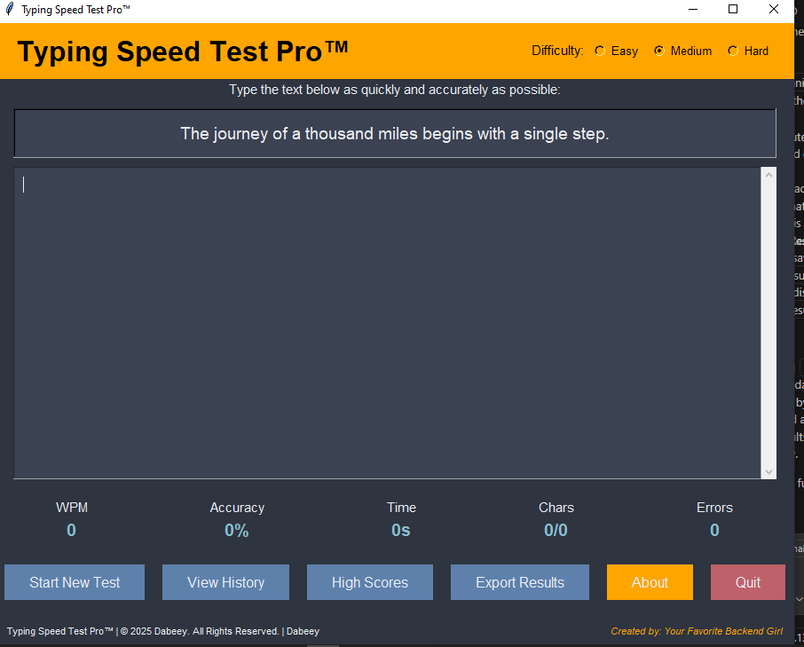

# Typing Speed Test Pro™

A professional typing speed test application with score tracking, history, and multiple difficulty levels. 

## Features

- 🚀 Real-time typing speed measurement (WPM)
- 📊 Accuracy tracking (character and word level)
- 🏆 High score system with difficulty levels
- 📅 Test history tracking
- 🎨 Branded UI with professional appearance
- 📥 Export results to JSON or text files
- ©️ Complete copyright and trademark protection

## Installation

1. Ensure you have Python 3.8+ installed
2. Install required dependencies:

pip install tkinter

Clone this repository or download the source files

## Run the application:
python typing_speed_test_pro.py

## Usage
- Select your difficulty level (Easy, Medium, Hard)

- Click "Start New Test" or begin typing immediately

- Type the displayed text as quickly and accurately as possible

- View your results when completed

- Check your progress in the History and High Scores sections

## Customization

To personalize the application with your branding:

Open typing_speed_test_pro.py in a text editor

Replace the following placeholders:

Dabeey - Your full name

Dabeey - Your company name

Your Favorite Backend Girl - Your signature or preferred credit line

Adjust the brand color by changing the brand_color hex value

## License
This software is licensed under the MIT License - see the LICENSE file for details.

## Copyright
© 2025 Dabeey. All Rights Reserved.
Typing Speed Test Pro™ is a trademark of Dabeey.

